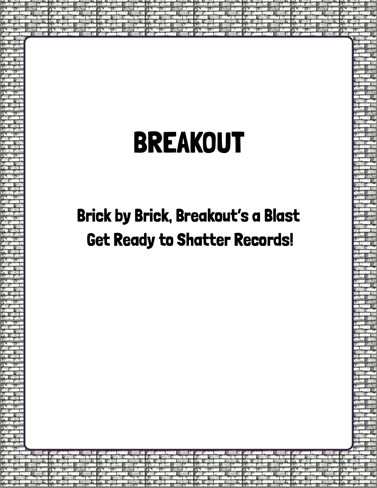
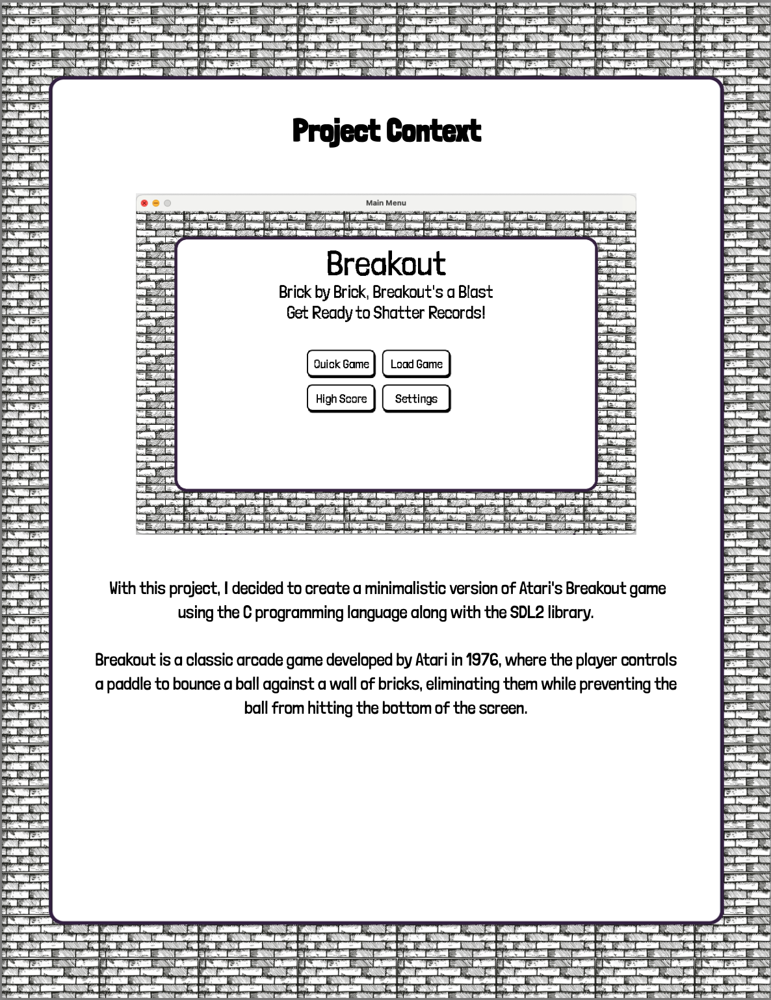
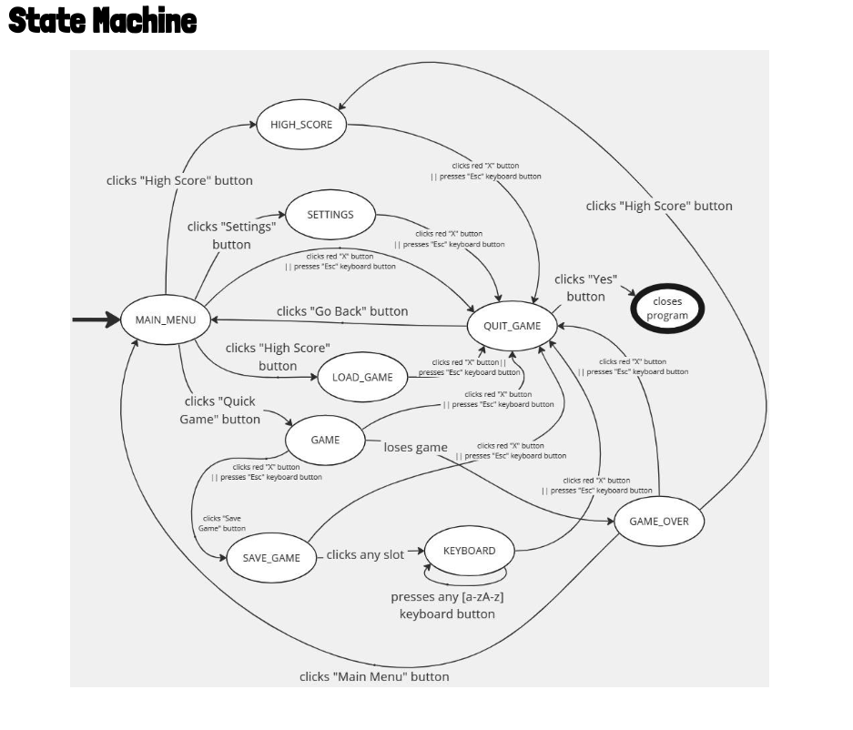

# 05 — Assets, Resources & Visual Reference

What the game *ships* with, what it actually *uses*, what each asset is for, and
what the screens look like — so you can carry the resources over and match the
look without opening the C project's `resources/` or running the binary.

The C++ rewrite reuses the **same** asset files (they're format-agnostic: PNG,
TTF, WAV). **Status: done** — the 8 *used* files have been copied verbatim into
[`Breakout_cpp/assets/`](../assets), **checksum-verified identical** (SHA-256) to
the originals in `Breakout_C/resources/`; the 5 dead files were left behind. So
the look and sound are already byte-for-byte the original's — nothing to re-rip.

---

## Visual reference

What you're rebuilding. (Screenshots copied from the original project docs.)

### Title screen


### Main menu — the core look


The visual identity: a **grey brick-wall border** framing a **white panel** with
a thin black outline; everything (title, taglines, buttons, gameplay) drawn in
**solid black** with the rounded **Londrina Solid** display font. Bricks are the
same black at varying alpha, so they read as shades of grey on the white panel.
That white panel image (`background-panel.png`) is blitted full-window every
frame; all shapes draw on top.

### State machine


(Matches the transition map in Doc 01 §"The screen state machine".)

---

## Asset manifest

### ✅ Used — now in `assets/` (copied & checksum-verified ✓)

Paths below are relative to `Breakout_cpp/assets/`.

| File | Type | Size / dims | Role in code |
|---|---|---|---|
| `background-panel.png` | PNG | 1728 × 1117 | **The** background — white panel + brick border, drawn full-window each frame (`background_texture`). |
| `button-small.png` | PNG | 154 × 69 | Menu/standard button background (`button_texture`), scaled into each button rect. |
| `save_file_button.png` | PNG | 1343 × 196 | Wide save-slot button background (`save_button_texture`). |
| `LondrinaSolid-Light.ttf` | TTF | 84 KB | The only font. "Londrina Solid" (Light weight) — a free Google Font, so re-downloadable if ever lost. |
| `music/LobbyMusic_MrBean.wav` | WAV stereo | ~46 s, 8.8 MB | Menu / lobby music (looped). |
| `music/Game_Youareamemory.wav` | WAV stereo 48 kHz | ~217 s, 42 MB | Normal in-game music (looped). |
| `music/RipTear.wav` | WAV stereo 48 kHz | ~258 s, 50 MB | Intense in-game music, after `score > 20` (looped). |
| `music/ba-dum-tss.wav` | WAV stereo 44.1 kHz | ~3 s, 0.8 MB | One-shot "ba-dum-tss" sting on game over. |

### 🗑️ Unused — do NOT carry over (verified: no source references them)

| File | Why it's here |
|---|---|
| `background.png` (1278 × 795) | An alternate full brick-wall background; the code only loads `background-panel.png`. Leftover. |
| `down.bmp`, `left.bmp` (640 × 480 each) | Classic SDL-tutorial test images; never loaded. Pure cruft. |
| `game_load_files.zip` (43 KB) | A backup zip of the `game_load_files/` data; not used at runtime. |
| `game_load_files/quotes.txt` | The two taglines, but they're hard-coded as `GAME_QUOTE_*` constants and never read from file. |

> Dropping the unused assets removes ~3.7 MB of dead images and a confusing zip.

### ✅ Audio in git — resolved: committed via **Git LFS**

The four WAVs were copied **as-is** (faithful: identical bytes → identical
sound); `assets/music/` is **~97 MB**, two of them uncompressed multi-minute
tracks. Committing those as ordinary git objects would bloat history forever, so
they're tracked with **Git LFS** instead. `.gitattributes` holds:

```
assets/music/*.wav filter=lfs diff=lfs merge=lfs -text
```

In history each WAV is a ~130-byte text **pointer**; the real audio lives in
`.git/lfs/` and is materialised on clone/checkout by the LFS smudge filter. The
repo was `git init`-ed and the assets committed this way in the first commit, so
the bytes are exact *and* the commit history stays light.

Alternatives considered and rejected: **transcoding** to OGG/MP3 (smaller, but
lossy and not byte-faithful — counter to "nothing changed"); **leaving the WAVs
uncommitted** behind `.gitignore` (a clone wouldn't get the audio at all).

> Heads-up for when you add a remote: pushing LFS objects needs a host that
> supports LFS (GitHub does; the free tier has a storage/bandwidth quota). Until
> then it all works fully offline — the objects are in your local `.git/lfs/`.

---

## Seed data files

The three live data files under `game_load_files/` (full formats in Doc 01
§"Data & file formats"). You'll want starting versions in the C++ repo:

| File | Ship as | Note |
|---|---|---|
| `settings.txt` | `0` | auto-play off |
| `savefile.txt` | 3 default/empty slots | or omit and let the loader create defaults on first run (malformed/missing → reset to default + `LOST`) |
| `highscores.txt` | **empty or regenerated** | ⚠️ the original's shipped rows use **64-char SHA-256** hashes from the old OpenSSL version; the current/your DJB2 verifier expects **16-char** hashes and will **reject** them. Don't copy the old rows verbatim — start empty or write rows with freshly-computed DJB2 hashes. |

---

## Carry-over checklist

The binary "feel" assets are **done** (`assets/`, this session). The three
runtime *data* files are intentionally **not** carried over verbatim — they get
seeded by code in their phase (highscores can't be copied at all; see below).

```
assets/                             ← DONE (copied & SHA-256-verified)
├── background-panel.png        ✅ copied
├── button-small.png            ✅ copied
├── save_file_button.png        ✅ copied
├── LondrinaSolid-Light.ttf     ✅ copied
└── music/
    ├── LobbyMusic_MrBean.wav    ✅ copied  (in Git LFS)
    ├── Game_Youareamemory.wav   ✅ copied  (in Git LFS)
    ├── RipTear.wav              ✅ copied  (in Git LFS)
    └── ba-dum-tss.wav           ✅ copied  (in Git LFS)

game_load_files/  (or wherever the C++ save code writes)   ← PENDING, by phase
├── settings.txt                .. Phase 10  seed "0"
├── savefile.txt                .. Phase 7   optional seed / auto-created on first run
└── highscores.txt              !! Phase 8   start EMPTY — must NOT copy (hash mismatch)

skipped (dead, verified): background.png, down.bmp, left.bmp,
                          game_load_files.zip, quotes.txt   (+ .DS_Store)
```

> Why data files are split out: they're game *state*, not *feel*. Copying
> `highscores.txt` verbatim actively breaks (64-char SHA-256 rows the DJB2
> verifier rejects), and `savefile.txt` holds three *real* saved games
> (`DD`/`DD`/`DIPLAT`), not blank slots — so neither is a faithful "default."

While you're at it (Doc 01 takeaway): the C hard-codes every path as a string
literal scattered across files. In C++, centralise them (a `Paths`/`Assets`
constants header) pointing at `assets/…`, and resolve relative to the executable
so the game runs from any directory, not just the project root.
